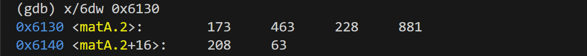
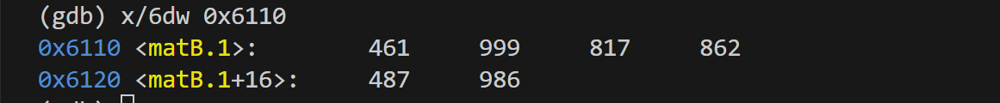

# bomblab 报告

姓名：李明蔚

学号：2024201517

| 总分 | phase_1 | phase_2 | phase_3 | phase_4 | phase_5 | phase_6 | secret_phase |
| --------- | ------------- | ------------- | ------------- | ----------------- |-----------|-----------|-----------|
| 3        | 1            | 1            | 1            | 0 |0  |0  |0  |


scoreboard 截图：


<!-- TODO: 用一个scoreboard的截图，本地图片，放到 imgs 文件夹下，不要用这个 github，pandoc 解析可能有问题 -->

## 解题报告

<!-- 对你拆掉的每个phase进行分析，并写出你得出答案的历程 -->

<!-- 如果能用伪代码还原题目源代码最佳（不属于先前提到的大段代码），语言描述自己的分析也可，每道题目的图片不建议超过两张 -->

### phase_1

```c
"If we can be completely simulated, do we need a real reality?"// 附上题目答案
```

讲解题目思路

phase_1涉及以下函数，写成伪代码形式：

    void phase_1(char* input)
    {
        const char *secret ="问题答案";
        if (strings_not_equal(input, secret) != 0) 
        {
            explode_bomb(); 
        }
    }

    int string_length(const char *s) 
    {
        int len = 0;
        while (s[len] != '\0') {
            len++;
        }
        return len;
    }

    int strings_not_equal(const char *s1, const char *s2) 
    {
        int len1 = string_length(s1);
        int len2 = string_length(s2);

        if (len1 != len2) return 1;

        for (int i = 0; i < len1; i++) 
        {
            if (s1[i] != s2[i]) return 1;
        }

        return 0;
    }

由此可知，我需要输入的应该和secret相同，才可以避免爆炸。

    1439:	48 8d 35 40 1d 00 00 	lea    0x1d40(%rip),%rsi        # 3180 <_IO_stdin_used+0x180>

根据这行汇编，可知secret在0x3180中，所以打印改地址的内容：x/s 0x3180

得到答案："If we can be completely simulated, do we need a real reality?"

### phase_2

```c
569060 796741 606758 1121533// 附上题目答案
```

讲解题目思路

伪代码如下：

    void phase_2(input)
    {
        int a0,a1,a2,a3;
        if(sscanf(input,"%d %d %d %d",&a0, &a1, &a2, &a3)!=4)
        {
            explode_bomb();
        }
        int matA[2][3],matB[3][2];
        int result[2][2];
        for(int row=0; row<2; row++)
        {
            for(int col=0; col<2; col++)
            {
                int sum=0;
                for(int k=0; k<3; k++)
                    sum+= matA[row][k] * matB[k][col];
                result[row][col]=sum;
            }
        }
        if (result[0][0] != a0 ||result[0][1] != a1 ||result[1][0] != a2 ||result[1][1] != a3)
        explode_bomb();
    }

所以题目实际让我做的是手算result的结果，即矩阵A*B的结果，所以我需要知道矩阵A，B具体的值,输入以下指令：



根据上文分析出的A,B的size，即A-2*3，B—3*2，进行矩阵乘法，得到结果：
result[2][2]=[[569060,796741],[606758,1121533]]

### phase_3

```c
5 -653// 附上题目答案
```

讲解题目思路

伪代码如下：

    void phase_3(char *input) 
    {
        int x; // 对应栈位置 (%rsp)
        int y; // 对应栈位置 0x4(%rsp)
        int result = 0;

        // 1561: sscanf 读取两个整数
        // 156d: 检查返回值，必须成功读取两个数 (返回值 > 1)
        if (sscanf(input, "%d %d", &x, &y) <= 1) 
        {
            explode_bomb();
        }

        // 1572 - 1579: 初始检查 y 的符号
        // 1572: cmpl $0, y
        // 1577: js 157e (如果 y 是负数，跳过炸弹)
        // 1579: call explode_bomb (如果 y >= 0，爆炸)
        if (y >= 0) 
        {
            explode_bomb();
        }

        // 157e - 1582: 检查 x 的范围
        // 如果 x > 7，跳转到 1622 爆炸
        if (x > 7) 
        {
            explode_bomb();
        }

        // 1588 - 1599: Switch 跳转表逻辑
        // 根据 x 的值跳转到不同的计算路径
        switch (x) 
        {
        case 0:
            // 路径: 159b -> 15a0 -> 15a5 -> 15aa -> 15b0 (爆炸)
            // result = 0x133 - 0x15a + 0x1c7 - 0x28d; // 计算后依然遇到炸弹
            explode_bomb(); 
            break;
        case 1:
            // 路径: 15f1 -> 15a0 -> ... -> 15b0 (爆炸)
            explode_bomb();
            break;
        case 2:
            // 路径: 15f8 -> 15a5 -> ... -> 15b0 (爆炸)
            explode_bomb();
            break;
        case 3:
            // 路径: 15ff -> 15aa -> 15b0 (爆炸)
            explode_bomb();
            break;
            
        // 注意：只有 case 4, 5, 6, 7 跳过了 15b0 处的 explode_bomb
        
        case 4:
            // 路径: 1606 -> 15b5
            // 初始 eax 由 rbx(0) + 0x28d 得到
            result = 0; 
            result += 0x28d; // 15b5: lea
            result -= 0x28d; // 15bb: sub
            result += 0x28d; // 15c0: add
            result -= 0x28d; // 15c5: sub
            // 最终 result = 0
            //但因为已经在开始限定y<0,所以此种情况舍去
            break;
            
        case 5:
            // 路径: 160d -> 15bb
            result = 0;
            result -= 0x28d; // 15bb: sub (0 - 653 = -653)
            result += 0x28d; // 15c0: add (-653 + 653 = 0)
            result -= 0x28d; // 15c5: sub (0 - 653 = -653)
            // 最终 result = -653
            break;
            
        case 6:
            // 路径: 1614 -> …… -> 15d6
            explode_bomb();
            break;
            
        case 7:
            // 路径: 161b -> 15d6
            explode_bomb();
            break;
            
        default:
            explode_bomb();
    }

    // 15ca: 再次检查 x 的范围
    // 如果 x > 5，跳转到 15d6 爆炸
    if (x > 5) 
    {
        explode_bomb();
    }
    // 15d0: 比较计算结果和 y
    if (result != y) 
    {
        explode_bomb();
    }

    }

由此得到答案：5，-653

### ......

## 反馈/收获/感悟/总结

<!-- 这一节，你可以简单描述你在这个 lab 上花费的时间/你认为的难度/你认为不合理的地方/你认为有趣的地方 -->

<!-- 或者是收获/感悟/总结 -->

<!-- 200 字以内，可以不写 -->

## 参考的重要资料

<!-- 有哪些文章/论文/PPT/课本对你的实现有重要启发或者帮助，或者是你直接引用了某个方法 -->

<!-- 请附上文章标题和可访问的网页路径 -->
