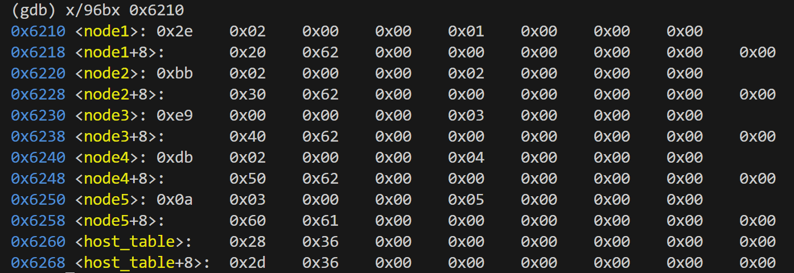

# bomblab 报告

姓名：李明蔚

学号：2024201517

| 总分 | phase_1 | phase_2 | phase_3 | phase_4 | phase_5 | phase_6 | secret_phase |
| --------- | ------------- | ------------- | ------------- | ----------------- |-----------|-----------|-----------|
| 3        | 1            | 1            | 1            | 0 |0  |0  |0  |


scoreboard 截图：


<!-- TODO: 用一个scoreboard的截图，本地图片，放到 imgs 文件夹下，不要用这个 github，pandoc 解析可能有问题 -->

## 解题报告

<!-- 对你拆掉的每个phase进行分析，并写出你得出答案的历程 -->

<!-- 如果能用伪代码还原题目源代码最佳（不属于先前提到的大段代码），语言描述自己的分析也可，每道题目的图片不建议超过两张 -->

### phase_1

```c
"If we can be completely simulated, do we need a real reality?"// 附上题目答案
```

讲解题目思路

phase_1涉及以下函数，写成伪代码形式：

    void phase_1(char* input)
    {
        const char *secret ="问题答案";
        if (strings_not_equal(input, secret) != 0) 
        {
            explode_bomb(); 
        }
    }

    int string_length(const char *s) 
    {
        int len = 0;
        while (s[len] != '\0') {
            len++;
        }
        return len;
    }

    int strings_not_equal(const char *s1, const char *s2) 
    {
        int len1 = string_length(s1);
        int len2 = string_length(s2);

        if (len1 != len2) return 1;

        for (int i = 0; i < len1; i++) 
        {
            if (s1[i] != s2[i]) return 1;
        }

        return 0;
    }

由此可知，我需要输入的应该和secret相同，才可以避免爆炸。

    1439:	48 8d 35 40 1d 00 00 	lea    0x1d40(%rip),%rsi        # 3180 <_IO_stdin_used+0x180>

根据这行汇编，可知secret在0x3180中，所以打印改地址的内容：x/s 0x3180

得到答案："If we can be completely simulated, do we need a real reality?"

### phase_2

```c
569060 796741 606758 1121533// 附上题目答案
```

讲解题目思路

伪代码如下：

    void phase_2(input)
    {
        int a0,a1,a2,a3;
        if(sscanf(input,"%d %d %d %d",&a0, &a1, &a2, &a3)!=4)
        {
            explode_bomb();
        }
        int matA[2][3],matB[3][2];
        int result[2][2];
        for(int row=0; row<2; row++)
        {
            for(int col=0; col<2; col++)
            {
                int sum=0;
                for(int k=0; k<3; k++)
                    sum+= matA[row][k] * matB[k][col];
                result[row][col]=sum;
            }
        }
        if (result[0][0] != a0 ||result[0][1] != a1 ||result[1][0] != a2 ||result[1][1] != a3)
        explode_bomb();
    }

所以题目实际让我做的是手算result的结果，即矩阵A*B的结果，所以我需要知道矩阵A，B具体的值,输入以下指令：


根据上文分析出的A,B的size，即A-2*3，B—3*2，进行矩阵乘法，得到结果：
result[2][2]=[[569060,796741],[606758,1121533]]

### phase_3

```c
5 -653// 附上题目答案
```

讲解题目思路

伪代码如下：

    void phase_3(char *input) 
    {
        int x; // 对应栈位置 (%rsp)
        int y; // 对应栈位置 0x4(%rsp)
        int result = 0;

        // 1561: sscanf 读取两个整数
        // 156d: 检查返回值，必须成功读取两个数 (返回值 > 1)
        if (sscanf(input, "%d %d", &x, &y) <= 1) 
        {
            explode_bomb();
        }

        // 1572 - 1579: 初始检查 y 的符号
        // 1572: cmpl $0, y
        // 1577: js 157e (如果 y 是负数，跳过炸弹)
        // 1579: call explode_bomb (如果 y >= 0，爆炸)
        if (y >= 0) 
        {
            explode_bomb();
        }

        // 157e - 1582: 检查 x 的范围
        // 如果 x > 7，跳转到 1622 爆炸
        if (x > 7) 
        {
            explode_bomb();
        }

        // 1588 - 1599: Switch 跳转表逻辑
        // 根据 x 的值跳转到不同的计算路径
        switch (x) 
        {
        case 0:
            // 路径: 159b -> 15a0 -> 15a5 -> 15aa -> 15b0 (爆炸)
            // result = 0x133 - 0x15a + 0x1c7 - 0x28d; // 计算后依然遇到炸弹
            explode_bomb(); 
            break;
        case 1:
            // 路径: 15f1 -> 15a0 -> ... -> 15b0 (爆炸)
            explode_bomb();
            break;
        case 2:
            // 路径: 15f8 -> 15a5 -> ... -> 15b0 (爆炸)
            explode_bomb();
            break;
        case 3:
            // 路径: 15ff -> 15aa -> 15b0 (爆炸)
            explode_bomb();
            break;
            
        // 注意：只有 case 4, 5, 6, 7 跳过了 15b0 处的 explode_bomb
        
        case 4:
            // 路径: 1606 -> 15b5
            // 初始 eax 由 rbx(0) + 0x28d 得到
            result = 0; 
            result += 0x28d; // 15b5: lea
            result -= 0x28d; // 15bb: sub
            result += 0x28d; // 15c0: add
            result -= 0x28d; // 15c5: sub
            // 最终 result = 0
            //但因为已经在开始限定y<0,所以此种情况舍去
            break;
            
        case 5:
            // 路径: 160d -> 15bb
            result = 0;
            result -= 0x28d; // 15bb: sub (0 - 653 = -653)
            result += 0x28d; // 15c0: add (-653 + 653 = 0)
            result -= 0x28d; // 15c5: sub (0 - 653 = -653)
            // 最终 result = -653
            break;
            
        case 6:
            // 路径: 1614 -> …… -> 15d6
            explode_bomb();
            break;
            
        case 7:
            // 路径: 161b -> 15d6
            explode_bomb();
            break;
            
        default:
            explode_bomb();
    }

    // 15ca: 再次检查 x 的范围
    // 如果 x > 5，跳转到 15d6 爆炸
    if (x > 5) 
    {
        explode_bomb();
    }
    // 15d0: 比较计算结果和 y
    if (result != y) 
    {
        explode_bomb();
    }

    }

由此得到答案：5，-653


### phase_4

```c
31 CA// 附上题目答案
```

讲解题目思路

伪代码如下：

    int func4_1(int n)
    {
        int eax = 0;          // mov $0, %eax
        if (n <= 0)           // test %edi,%edi ; jle 1658
            return 0;
        eax = n;              // mov %edi,%eax
        if (n == 1)           // cmp $1,%edi ; je 1658
        return eax;            // return n
        eax = func4_1(n - 1); // sub $1,%edi ; call func4_1
        eax = 2 * eax + 1;    // lea 0x1(%rax,%rax,1),%eax
        return eax;           // ret
    }

由此可知，f(1)=1, f(n)=2*f(n-1)+1 (n>=1)，通式即为f(n)=2^n-1。


    void func4_2(int n, int move, char from, char to, char temp, char *out)
    {
        // 1667: mov %edx,%r12d  -> 保存 from
        // 166a: mov %ecx,%r13d  -> 保存 to
        // 167d: r14d 保存 temp
        // rbp 保存 out 指针    
        if (n == 1) 
        {
            // 169f: base case
            // mov %dl,0x0(%rbp) : out[0] = dl (from)
            // mov %cl,0x1(%rbp) ； out[1] = cl (to)
            //movb $0x0,0x2(%r9) :  out[1] = '\0'
            out[0] = from;
            out[1] = to;
            out[2] = '\0';
            return;
        }

        // 1681: call func4_1(n-1)
        int t = func4_1(n - 1);  // t = 2^(n-1) - 1
        if (t >= move) 
        {
            // 16b9: ecx = r14b (temp)
            // 16bd: edx = r12b (from)
            // 16c4: r8d = r13b (to)
            // 16c8: esi = 原来的 move
            // 16ca: edi = n-1
            func4_2(n - 1, move, from, temp, to, out);
        } 
        else 
        {
            int mid = t + 1;
            if (move == mid) 
            {
                // 168a..1699：正好是中间那一步，直接 from->to
                // 1691: out[0] = r12b (from)
                // 1695: out[1] = r13b (to)
                out[0] = from;
                out[1] = to;
                out[2] = '\0';
            } 
            else 
            {
                // 16d4: ecx = r13b (to)
                // 16d8: edx = r14b (temp)
                // 16dc: ebx = move - t
                // 16de: esi = (move - t) - 1 = move - t - 1
                // 16e4: r8d = r12b (from)
                int new_move = move - t - 1;
                func4_2(n - 1, new_move, temp, to, from, out);
            }
        }
    }

由此可知，func4_2写的是递归完成汉诺塔移动。move 从 1 开始计数；func4_1(n-1) 计算出先搬 n-1 个盘子所需步数；第 t+1 步是最大盘 from→to；前半段、后半段分别递归，但柱子角色做了轮换。

    void phase_4(const char *user_input)
    {
        int  intput1;        // 对应 0xc(%rsp)
        char input2[16];    // 对应 0x10(%rsp)，比实际用的 3 字节大很多，安全
        char output[3];  // 对应 0x14(%rsp)，存 func4_2 的结果

        // 1707: rcx = &input2
        // 170c: rdx = &input1
        // 1711: rsi = format string (推断为 "%d %s" 一类)
        // 1718: call __isoc99_sscanf
        if (sscanf(user_input, "%d %s", &int_val, str_val) != 2) 
        {
            explode_bomb();
        }
        // 1722: edi = 5 ; call func4_1
        int t = func4_1(5);   // target = 2^5 - 1 = 31

        if (input != t) 
        {
            explode_bomb();
        }

        // 1732: rdi = &input2 ; call string_length
        // 173c: cmp $2,%eax ; jne explode_bomb
        if (string_length(input2) != 2) 
        {
            explode_bomb();
        }

        // 1741: rbx = &output
        // 1749: r9  = rbx            -> 输出缓冲区
        // 174f: r8d = 0x42 'B'
        // 1754: ecx = 0x43 'C'
        // 1759: edx = 0x41 'A'
        // 175e: esi = 10
        // 1763: edi = 5
        func4_2(5, 10, 'A', 'C', 'B', output_str);

        // 1768: rdi = &input2 (用户输入)
        // 176d: rsi = &output
        // 1770: call strings_not_equal
        if (strings_not_equal(input2, output)) 
        {
            explode_bomb();
        }
    }

由此可知，我要求的有两个：

1. f(5)=2^5-1=31,所以第一个输入为31

2. func4_2(5, 10, 'A', 'C', 'B', output_str)，即需要求出5个圆盘，第10步，从哪里挪向哪里，这里我一步一步手推：
    
    (1) 5个盘子，A->C，第10步，前15步是第一部分，说明这第10步在第一部分。
    
    (2) 问题转为，4个盘子，A->B，第10步，前7步第一部分，第8步第二部分，后7步第三部分，说明这第10步在第三部分。

    (3) 问题转为，3个盘子，C->B，第2步，前3步第一部分，说明这第2步在第一部分。

    (4) 问题转为，2个盘子，C->A，第2步，由此我们可以直接得到答案：C->A。

综上所述，答案为31 CA


### phase_5

```c
-2 21// 附上题目答案
```

讲解题目思路

伪代码如下：

    void phase_5(char *input)
    {
        int x;        // (%rsp)
        int y;        // 0x4(%rsp)
        if (sscanf(input, "%d %d", &x, &y) <= 1)explode_bomb();
        if (x >= 0)explode_bomb();
        x = x & 0xF;
        if (x == 15)explode_bomb();

        int sum = 0;     // %ecx
        int count = 0;   // %edx
        int *arr = array; // 3240 <array.0>

        while (1)
        {
            count++;               // add $0x1,%edx
            x = arr[x];            // mov (%rsi,%rax,4),%eax
            sum += x;              // add %eax,%ecx

            if (x == 15)           // 到终点 15 才停
                break;
        }

        x = 15;                    // movl   $0xf,(%rsp)
        if (count != 2)explode_bomb();
        if (sum != y)explode_bomb();
    }

由此可知，本题就是要求输入一个起点x(x<0)，让程序按array[x] -> array[array[x]] 追踪，必须刚好两步走到 15，且路径上的两个数之和 = y。

首先打印出array数组：

(gdb) x/16dw 0x3240
0x3240 <array.0>:       10      2       14      7
0x3250 <array.0+16>:    8       12      15      11
0x3260 <array.0+32>:    0       4       1       13
0x3270 <array.0+48>:    3       9       6       5

由此可知array[14]=6,array[6]=15;

所以x=14，y=6+15=21；

又因为x<0,14的二进制为1110，而1110对于一个有符号数而言，其真实值是-2，所以x=-2。

综上，答案为-2 21


### phase_6

```c
1 2 3 5 6 4// 附上题目答案
```

讲解题目思路

伪代码如下：

    // 节点结构（根据 gdb 结果推断）
    typedef struct Node 
    {
        int value;          // *(int *)node
        struct Node *next;  // *(node + 8)
    } Node;
    Node node1;      // 6210 <node1>
    void phase_6(char *input)
    {
        int nums[6];          // 对应 0x10(%rsp) 开始的 6 个 int
        Node *node[6];   // 对应 0x30(%rsp) 开始的 6 个指针
        Node *p;
        int i, j;
        read_six_numbers(input, nums);
        /*
        1865: lea 0x10(%rsp),%r14     -> r14 = &nums[0]
        186f: mov %r14,%rsi           -> 第二个参数 = &nums
        1872: call read_six_numbers
        */
        for (i = 0; i < 6; i++)
        {
            if (nums[i] < 1 || nums[i] > 6)
            explode_bomb();
            /*
            1951: mov (%r14),%eax     -> eax = nums[i]
            1954: sub $0x1,%eax
            1957: cmp $0x5,%eax
            195a: ja explode_bomb     -> nums[i]-1 > 5 -> nums[i] > 6, 又因为是ja所以无符号，num[i]-1<0时,num[i]-1恒大于5，所以这个判断也包含num[i]<1
            */

            for (j = i + 1; j < 6; j++) //196a: mov %r15,%rbx;1892: add $0x1,%rbx;1896: cmp $0x5,%ebx;1899: jg 1946
            {
                if (nums[i] == nums[j])
                    explode_bomb();
            /*
            189f: mov 0x0(%r13,%rbx,4),%eax -> eax = nums[j]
            18a4: cmp %eax,0x0(%rbp)        -> 比较 nums[j] 和 nums[i]
            18a7: jne 1892 <phase_6+0x4b>   -> 相等则炸
            */
            }
        }
        int *p   = &nums[0];      // r12 = &nums[0]
        int *end = &nums[6];      // rdx = &nums[6]
        while (p != end)          // cmp r12,rdx ; jne
        {
            *p = 7 - *p;          // mov $7,%ecx;sub (%r12),%eax;add $0x4,%r12
            p++;                  // 对应: add $0x4,%r12
        }
        i = 0;                                       // rsi = 0
        while (i < 6)                               // 18ff: cmp $6,%rsi;jne
        {
            int index = nums[i];                    // 18d6: mov 0x10(%rsp,%rsi,4){nums[i]} -> ecx
            p = &node1;                             // 18df: lea node1 -> rdx
            j = 1;                                  // 18da: eax = 1
            while (j < index)                      // 18f2: cmp ecx, eax
            {
                p = p->next;                       // 18eb: mov 0x8(%rdx),%rdx
                j++;                                // 18ef: add $1,%eax
            }
            node[i] = p;                       // 18f6: mov %rdx,0x30(%rsp,%rsi,8){node[i]}
            i++;                                    // 18fb: add $1,%rsi
        }

        for (i = 0; i < 5; i++)
            node[i]->next = node[i + 1];
        node[5]->next = NULL;
        /*
        1905: mov 0x30(%rsp),%rbx
        190f: mov %rax,0x8(%rbx)    → node[0]->next = node[1]
        1918: mov %rdx,0x8(%rax)    → node[1]->next = node[2]
        ...
        1937: movq $0x0,0x8(%rax)   → ndoe[5]->next = NULL
        */

        p = node[0];
        for (i = 0; i < 5; i++)
        {
            if (p->next->value >= p->value)
                explode_bomb();
            p = p->next;
        }
        /*
        197b: mov 0x8(%rbx),%rax    → rax = p->next
        197f: mov (%rax),%eax       → eax = p->next->value
        1981: cmp %eax,(%rbx)       → 比较 p->value 与 next->value
        1983: jge                   → next >= cur 时炸
        */
        return 0;
}

由此观之，本题基本逻辑是输入6个数，将这六个数做一个（7-x）的线性映射，按照映射后的结果重排链表，使得重排后的链表严格单调递减。

所以，现在我应该先知道原链表的值。



根据图片信息，可以得到以下数据：

node1 @ 0x6210:
  0x2e 0x02 0x00 0x00  | value
  0x01 0x00 0x00 0x00  | index
  0x20 0x62 0x00 0x00 0x00 0x00 0x00 0x00 | next = 0x6220

node2 @ 0x6220:
  0xbb 0x02 0x00 0x00  | value
  0x02 0x00 0x00 0x00  | index
  0x30 0x62 ...        | next = 0x6230

node3 @ 0x6230:
  0xe9 0x00 0x00 0x00  | value
  0x03 0x00 0x00 0x00  | index
  0x40 0x62 ...        | next = 0x6240

node4 @ 0x6240:
  0xdb 0x02 0x00 0x00  | value
  0x04 0x00 0x00 0x00  | index
  0x50 0x62 ...        | next = 0x6250

node5 @ 0x6250:
  0x0a 0x03 0x00 0x00  | value
  0x05 0x00 0x00 0x00  | index
  0x60 0x62 ...        | next = 0x6260

node6 @ 0x6260:
  0x28 0x36 0x00 0x00  | value
  0x06 0x00 0x00 0x00  | index
  0x00 ...             | next = NULL

转化为十进制,各个节点的值分别为: 558,699,233,731,778,13864

将其倒序排列后的index为：6,5,4,2,1,3

将其反向映射（7-x=y->x=7-y）:1,2,3,5,6,4

综上，答案为：1 2 3 5 6 4


### secret_phase

```c
33022// 附上题目答案
```

讲解题目思路

首先，我们需要进入secret_phase，经过尝试，发现在phase_6的答案后面输入我的Secret word，即可进入secret_phase。

现在来分析secret_phase和func_7的汇编代码，将其理解为C语言伪代码，大致如下：

    void secret_phase()
    {
        char *input=read_line(); //1be4,1be9
        int len=string_length(input); //1bef
        if(len>20)
        {
            explode_bomb;
        }              //1bf4,1bf7
        int x=0,y=0,i=0;
        int z=func_7(input,x,y,i);
        if(z==0)explode_bomb;
        return;
    }

1b01:44 03 04 b4  add (%rsp,%rsi,4),%r8d

1b08:44 03 5c b4 20  add 0x20(%rsp,%rsi,4),%r11d

1b5f:42 03 44 94 40  add 0x40(%rsp,%r10,4),%eax

1b64:42 03 54 94 60  add 0x60(%rsp,%r10,4),%edx

由这四行我们可以推断出，存在4个数组，即19cf~1ac6对应4个数组：
    
A=[-2,-1,1,2,2,1,-1,-2]

B=[1,2,2,1,1,2,2,1]
    
C=[-1,0,0,1,1,0,0,-1]
    
D=[0,1,1,0,0,-1,-1,0]
    
根据：

1b74: mov 0x8(%rsi), %rsi;

1b87: cmpb $0x1, (%rsi,%rdx,1);

可以看出存在matrix[8][];

接下来我先确认matrix的具体内容：

(gdb) p &row0
$1 = (<data variable, no debug info> *) 0x55555555a1a0 <row0>

(gdb)x/32xb 0x55555555a1a0
0x55555555a1a0 <row0>: 0x00 0x00 0x01 0x00 0x00 0x01 0x00 0x00 0x55555555a1a8 <row0+8>: 0xb0 0xa1 0x55 0x55 0x55 0x55 0x00 0x00 
0x55555555a1b0 <row1>: 0x00 0x00 0x00 0x01 0x00 0x00 0x00 0x01 0x55555555a1b8 <row1+8>: 0xc0 0xa1 0x55 0x55 0x55 0x55 0x00 0x00

由此可知matrix的size为[8][8]

row0对应第0行的内容，row0+8对应row1的地址

依次类推：

得到matrix[8][8]=
[
    [0,0,1,0,0,1,0,0],
    [0,0,0,1,0,0,0,1],
    [1,0,1,0,0,1,0,0],
    [1,0,0,0,0,0,0,0],
    [0,1,0,0,1,0,1,0],
    [1,0,0,1,1,0,0,0],
    [0,0,0,0,0,1,0,1],
    [0,1,0,0,0,0,0,0]
]

    int fun_7(char *input,int x,int y,int i)
    {
        char ch=s[i];
        if (x == 4 && y == 7) 
        {
            if (ch == '\0') return 1;
            else return 0;
        } //1ace~1ae7
        if (ch == '\0') return 0; //1adf~1ae7
        if (i > 19) return 0;  //1ae9~1af2
        int n=ch&7; //1af7,1afb
        int tx = x + C[n];  //1b5f
        int ty = y + D[n];  //1b64
        if (tx < 0 || tx > 7 || ty < 0 || ty > 7)return 0; //1b70~1b8b
        if (matrix[tx][ty] == 1)return 0;  //1b87,1b8b
        int nx = x + A[n];  //1b01
        int ny = y + B[n];  //1b08
        if (nx < 0 || nx > 7 || ny < 0 || ny > 7)return 0; //1b0d~1b1b
        if (matrix[nx][ny] == 1)return 0;  //1b94~1bb6
        return func7(s, nx, ny, i+1);  //1bbc~1bc6
    }

由此观之，本题题意是从(0,0)走向(4,7),每次走的方向为A[k],B[k],对应matrix[nx][ny]，同时需要检验临近方向C[k],D[k]，即matrix[tx][ty]，不能为1。由此，经过遍历尝试，得到路径，33022

综上，答案为：33022


## 反馈/收获/感悟/总结

<!-- 这一节，你可以简单描述你在这个 lab 上花费的时间/你认为的难度/你认为不合理的地方/你认为有趣的地方 -->
我觉得难度很大，寄存器太多，很容易乱，所以做的很慢。
<!-- 或者是收获/感悟/总结 -->
相应的收获也很大，对汇编语言的熟练度有了很大提升
<!-- 200 字以内，可以不写 -->

## 参考的重要资料

<!-- 有哪些文章/论文/PPT/课本对你的实现有重要启发或者帮助，或者是你直接引用了某个方法 -->
CSAPP：chapter 3
1-5-machine-arch.ppt
1-5-machine-arch-preview.ppt
1-6-machine-intro.ppt
1-7-machine-basics.ppt
1-8-machine-control-preview.ppt
1-9-machine-procedure-review.pptx
<!-- 请附上文章标题和可访问的网页路径 -->
